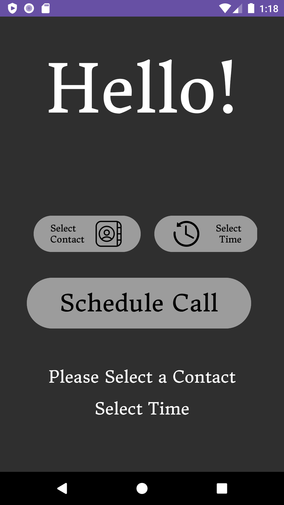

# Android-Call-Scheduler

Discovered that Android introduced changes starting from Android 10, which restricted the ability to make calls programmatically.

["Privacy changes in Android 10"](https://developer.android.com/about/versions/10/privacy/changes#background-activity-starts)

Nonetheless, the app remains fully operational on Android versions preceding Android 10.